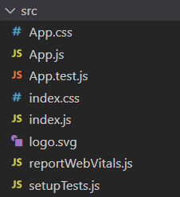
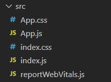
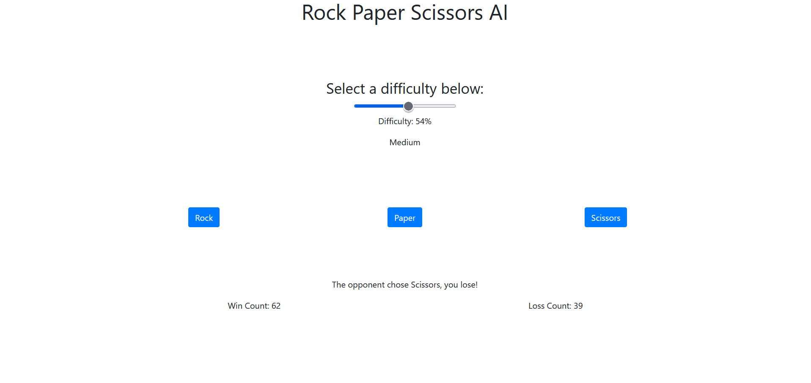

# React Workshop

This workshop will teach you how to create a basic React app. The final result will be a rock paper scissors AI

## Prerequisite Software

- An IDE (Recommend VS Code)
- npm (To install 3rd party modules/libraries)
- npx (To create a react app)

## Steps:

### Creating the app

1. Create a new react app with the following command:

   ```
   npx create-react-app {name of react app}
   ```

   Be sure to replace {name of react app} with your own app name. For this workshop, we will make a rock paper scissors app. Here is the command we will use.

   ```
   npx create-react-app rps-ai
   ```

### Project Architecture

2. Navigate inside the app directory.

   ```
   cd {app dir}
   ```

   In this example, the command would be

   ```
   cd rps-ai
   ```

   Inside the `{app dir}/src` directory you will find the following contents:

   

- **App.css**: Style-sheet `for App.js`
- **App.js**: This a Component that holds the UI code for the app
- **App.test.js**: This is a test file for `App.js`. We will not do unit testing in this workshop so we can safely delete it.
- **index.css**: This is the style-sheet that gets applied in `index.js`
- **index.js**: This is the entry point for the program. `App.js` should be instantiated in here.
- **logo.svg**: This is a react logo that is added with the create-react-app template. We can safely delete this.
- **reportWebVitals.js**: This will report performance metrics. This is optional, we will leave it in our example.
- **setupTests.js**: This is for setting up unit tests. Let's delete it for our example.

  Here is what the src folder looks like now:

  

### Coding

3. We are going to use react-bootstrap, a module that will make our UI code simpler. Run the following command to install react-bootstrap:

   ```
   npm i react-bootstrap
   ```

4. Now, you need to add the bootstrap stylesheet to your project. To do this, add the following code to `{app dir}/public/index.html`:

   ```
   <link
       rel="stylesheet"
       href="https://maxcdn.bootstrapcdn.com/bootstrap/4.3.1/css/bootstrap.min.css"
       integrity="sha384-ggOyR0iXCbMQv3Xipma34MD+dH/1fQ784/j6cY/iJTQUOhcWr7x9JvoRxT2MZw1T"
       crossorigin="anonymous"
   />
   ```

5. Next, let's remove the template code so we have a clean slate to work on. Replace the contents of `App.js` with the following code:

   ```
   import "./App.css"; // Import our style-sheet

   /**
    *  Contains the code for the application
    */
   function App() {}

   // Makes the App component available to other components.
   export default App;
   ```

6. Now we will import some components from bootstrap. Add the following imports to `App.js`:

   ```
   import Form from "react-bootstrap/Form";
   import Container from "react-bootstrap/Container";
   import Row from "react-bootstrap/Row";
   import Col from "react-bootstrap/Col";
   import Button from "react-bootstrap/Button";
   ```

7. Now we will write the JSX portion of `App.js`.

   ```
   /**
    *  Contains the code for the application
    */
   function App() {
   return (
       <div className="App">
           <Container>
               <h1 className="pb-5">Rock Paper Scissors AI</h1>
               <h3 className="pt-5">Select a difficulty below:</h3>
               <Form.Range min="0" max="100" />
               <Row className="py-5">
                   <Col>
                       <Button</Button>
                   </Col>
                   <Col>
                       <Button></Button>
                   </Col>
                   <Col>
                       <Button></Button>
                   </Col>
               </Row>
           </Container>
       </div>
       );
   }
   ```

8. Now we must add the functionality. First we will create some variables. We will use the `useState` hook to bind our variables to the UI components. First you must import the `useState` hook.

   ```
   import { useState } from "react";
   ```

   Next, add the variables as local variables in the `App()` function, before the return statement:

   ```
   function App() {
   const [difficulty, setDifficulty] = useState(50.0);
   const [winCount, setWinCount] = useState(0);
   const [lossCount, setLossCount] = useState(0);
   const [result, setResult] = useState(null);

   return (
    <div className="App">
      <Container>
        <h1 className="pb-5">Rock Paper Scissors AI</h1>
        <h3 className="pt-5">Select a difficulty below:</h3>
        <Form.Range
          min="0"
          max="100"
          value={difficulty}
          onChange={(e) => setDifficulty(e.target.value)}
        />
        <p>Difficulty: {difficulty}%</p>
        <Row className="py-5">
          <Col>
            <Button></Button>
          </Col>
          <Col>
            <Button></Button>
          </Col>
          <Col>
            <Button></Button>
          </Col>
        </Row>
        <p className="pt-5">{result}</p>
        <Row>
          <Col>Win Count: {winCount}</Col>
          <Col>Loss Count: {lossCount}</Col>
        </Row>
      </Container>
    </div>
   );
   ```

9. The last thing we will do is add some logic to control the game.

   ```
   function App() {
   const [difficulty, setDifficulty] = useState(50.0);
   const [winCount, setWinCount] = useState(0);
   const [lossCount, setLossCount] = useState(0);
   const [result, setResult] = useState(null);

   function choiceToString(input) {
       switch (input) {
           case 0:
               return "Rock";
           case 1:
               return "Paper";
           default:
               return "Scissors";
       }
   }

   function choose(input, difficulty) {
       const rand = Math.random() \* 100;
       if (rand >= difficulty) {
           return (input + 2) % 3;
       } else if (rand >= (100 - difficulty) / 2.0) {
           return (input + 1) % 3;
       } else {
           return input;
       }
   }

   function checkWin(me, ai) {
       if (me == (ai + 1) % 3) {
           setWinCount(winCount + 1);
           return `The opponent chose ${choiceToString(ai)}, you win!`;
       } else if (me == (ai + 2) % 3) {
           setLossCount(lossCount + 1);
           return `The opponent chose ${choiceToString(ai)}, you lose!`;
       } else {
           return `The opponent chose ${choiceToString(ai)}, tie!`;
       }
   }

   function playGame(input, difficulty) {
       setResult(checkWin(input, choose(input, difficulty)));
   }

   function difficultyToString(difficulty) {
       if (difficulty < 100.0 / 3.0) {
           return "Easy";
       } else if (difficulty < (2 \* 100.0) / 3.0) {
           return "Medium";
       } else {
           return "Hard";
       }
   }

   return (
    <div className="App">
      <Container>
        <h1 className="pb-5">Rock Paper Scissors AI</h1>
        <h3 className="pt-5">Select a difficulty below:</h3>
        <Form.Range
          min="0"
          max="100"
          value={difficulty}
          onChange={(e) => setDifficulty(e.target.value)}
        />
        <p>Difficulty: {difficulty}%</p>
        <p className="pb-5">{difficultyToString(difficulty)}</p>
        <Row className="py-5">
          <Col>
            <Button onClick={(e) => playGame(0, difficulty)}>Rock</Button>
          </Col>
          <Col>
            <Button onClick={(e) => playGame(1, difficulty)}>Paper</Button>
          </Col>
          <Col>
            <Button onClick={(e) => playGame(2, difficulty)}>Scissors</Button>
          </Col>
        </Row>
        <p className="pt-5">{result}</p>
        <Row>
          <Col>Win Count: {winCount}</Col>
          <Col>Loss Count: {lossCount}</Col>
        </Row>
      </Container>
    </div>
   );
   }
   ```

10. The last thing to do is fix the page title. Go into `{app dir}/public/index.html` and change line 33 to a title of your choose.

    ```
    <title>Rock Paper Scissors AI</title>
    ```

### Final Result


